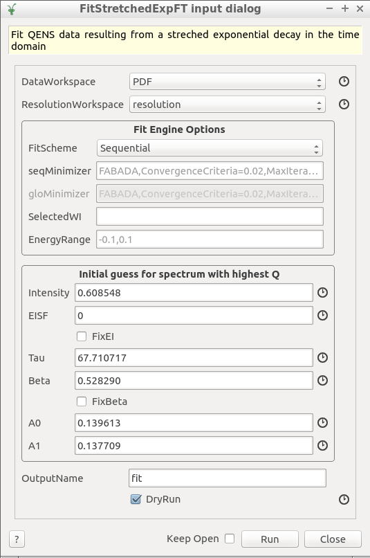

### Fit Engine Options
- **FitScheme**: Either *Sequential* or *Global* fit. The sequential fit begins with the highest selected spectrum, and proceeds towards the lowest selected spectrum.
- **seqMinimizer**: options for the sequential fit
- **gloMinimizer**: options for the global fit
- **SelectedWI**: selected workspace indexes to fit. The first workspace begins with index 0. If empty, all spectra are selected. Examples: 2,3,7 for three workspaces, 3-8 for five consecutive workspaces.
- **EnergyRange**: energy range over which to carry the fit, in units of meV

### Initial Guess for spectrum with highest Q

In the sequential fit, we begin fitting the spectrum with the highest Q, and then proceed towards spectra of lower Q. Thus, we need an initial guess of the fitting parameters for the first spectrum to fit. 

The model to be convolved with the resolution fuction:
$Intensity (EISF \delta(E) + (1-EISF)StretchedExpFT(E,Tau, Beta)) + (A0 + A1 E)$

## Other options
- **OutputName**: prefix for all files output from the fit
- **dryrun**: This option will not carry out the fit. Instead, a string representation of the fit funtion for the spectrum with the highest Q will be printed to the *Restuls Log* window:

The purpose of the dryrun is to use import string in the *Fit Wizard* window in order to carry out an interactive fit and in this way fine tune the fitting parameters that will serve as initial guess.

After importing the string, we can apply the model onto the spectrum with the highest Q

After this, we can begin tweaking the parameters for this one-spectrum fit. Once satisfied, we can enter this initial guess into the algorithm's dialog.

